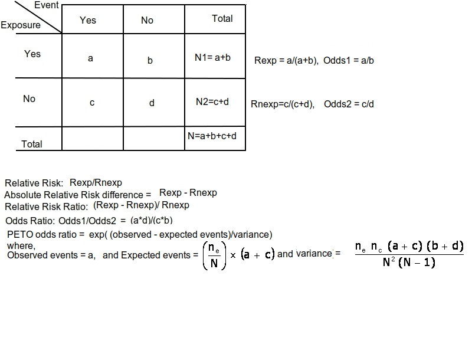

```{r echo=F, warning=FALSE, message=FALSE}
library(knitr)
opts_chunk$set(fig.width=9, fig.height=6, fig.path='Figs/',
        echo=F, warning=FALSE, message=FALSE, fig.pos = "H", comment = "")

```

# Dichotomous outcome (Berkey et al. (1995))

## The Methods and Data 

Berkey et al. (1995) describe the meta-analytic random- and mixed-effects models and provide the equation for the empirical Bayes estimator for the amount of (residual) heterogeneity (p. 398). The models and methods are illustrated with the BCG vaccine dataset (Colditz et al., 1994). 


First, we load the package that contains the commands we will use later on. This can be done using the **library('name of the package')** command. The package that we will use is **metafor**. If the package is not installed in our computer we can use the **install.packages('name of the package')** command 

```{r}
# install.packages('metafor')
library(metafor)
```
The data are provided in the package and can be loaded straight from it using their name **dat.bcg**.

The contents of the dataset are: 
```{r}
dat.bcg
```

Per trial, a 2x2 matrix looks like the following. 
```{r echo=F,message=FALSE,  out.width = "50%", out.height="50%"}
library(knitr)
#img1 <- readPNG("Figures/2x2.png", native = TRUE, info = TRUE)

```

As a first step we will calculate the log risk-ratios and corresponding sampling variances with **escalc()** function:
```{r , fig.height=5, fig.cap="2x2 matrix", fig.width=5}
dat <- escalc(measure="RR", ai=tpos, bi=tneg, ci=cpos, di=cneg, data=dat.bcg)
dat
```

The metafor package calculates the sampling variances of the log risk ratios as described by Berkey et al. (1995) on page 399 (right under the 2×2 table). If we want to cross-validate the risk ratios we can calculate them manually. 

```{r}
Risk_exposed   =  with(dat, tpos/(tpos+tneg) )
Risk_unexposed =  with(dat, cpos/(cpos+cneg) )
RR = Risk_exposed/Risk_unexposed
log_RR=  log(RR)
```

## Fixed-effect model
Now we can fit a fixed-effect model to these data. We can save the summary into an object using the <- or = signs. using the **rma()** function we can estimate the pooled risk-ratio.

```{r}
FE = rma(data = dat, yi = yi , vi = vi, 
         slab = author,# indicate which variable contains the names of the trials 
         method = "FE")

FE

```

Also we can observe the forest plot.

```{r}
forest(FE, atransf = exp ,showweights = T)
```


## Random-Effects Model

Now we can fit a random-effects model to these data, using the DerSimonian-Laird estimator  for the amount of heterogeneity with:

```{r}
RE <- rma(yi, vi, data=dat, method="DL", slab = author)
RE
forest(RE)
```


If we use the *?* sign in front of a function we can go to the help file of the function. 

```{r}
?rma
```

Here we can observe that there are various types of $\hat{\tau}^2$ estimators. For instance, the empirical Bayes estimator. 

```{r}
RE.EB <- rma(yi, vi, data=dat, method="EB", slab = author)
RE.EB
forest(RE.EB)
```

These results match exactly what Berkey et al. (1995) report on page 408: The amount of heterogeneity ("between-trial variance") is estimated to be $\hat{\tau}^2 = 0.268$ and the pooled estimate is $\hat{\mu} = -0.5429$ with a standard error of $SE[\hat{\mu}] = 0.1842$.


## Mixed-Effects Model

As we can see we slightly reducing the heterogeneity present in our estimates. Nevertheless, we may assume that there is another variable that is modifying our estimates. Then we can use a mixed-effects model with absolute latitude (centered at 33.46 degrees) as moderator. 
In this case, we assume that part of the variability see into our estimated is due to the place that the trial has been conducted and can be fitted with:

```{r}
res.ME <- rma(yi, vi, mods=~I(ablat-33.46), data=dat, method="EB")
res.ME
```


Again, the results match the findings from Berkey et al. (1995): The residual amount of heterogeneity is now $\hat{\tau}^2 =$ `r round(res.ME$tau2,3)` and the estimated model is $log(RR) =$ `r round(res.ME$beta,3)[1]` `r round(res.ME$beta,3)[2]` $\times (x - 33.46)$, where $x$ is the distance from the equator (in degrees latitude). The standard errors of the model coefficients are $SE[b_0] =$ `r round(res.ME$se, 3)[1]` and $SE[b_1] =$ `r round(res.ME$se, 3)[2]` .

The amount of variance (heterogeneity) accounted for by the absolute latitude moderator is provided in the output above. It can also be obtained with the **anova()** function:

```{r}

anova(RE, res.ME)

```

<code output>
        df     AIC     BIC   logLik    LRT   pval      QE  tau^2    R^2
Full     3 29.3011 30.9960 -11.6506               35.8827 0.1572       
Reduced  2 32.2578 33.3877 -14.1289 4.9566 0.0260 85.8625 0.2682 41.38%
</code>
The value below $R^2$ indicates that approximately 41% of the heterogeneity has been accounted for.

The predicted average risk ratios at 33.46 and 42 degrees reported by Berkey et al. (1995) can be computed with:

```{r}
predict(res.ME, newmods=c(33.46,42)-33.46, transf=exp, digits=2)
```


# Fixed-Effects Model with moderator

The results from a fixed-effects model with absolute latitude as the predictor can be obtained with:

```{r}
res.FE <- rma(yi, vi, mods=~I(ablat-33.46), data=dat, method="FE")
res.FE
```


The predicted risk ratios at 33.46 and 42 degrees are now:
```{r}
predict(res.FE, newmods=c(33.46,42)-33.46, transf=exp, digits=2)
```


# References 

Berkey, C. S., Hoaglin, D. C., Mosteller, F., & Colditz, G. A. (1995). A random-effects regression model for meta-analysis. //Statistics in Medicine, 14//(4), 395--411.

Colditz, G. A., Brewer, T. F., Berkey, C. S., Wilson, M. E., Burdick, E., Fineberg, H. V., et al. (1994). Efficacy of BCG vaccine in the prevention of tuberculosis: Meta-analysis of the published literature. //Journal of the American Medical Association, 271//(9), 698--702.
