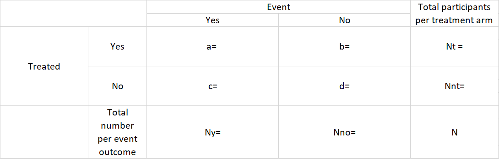
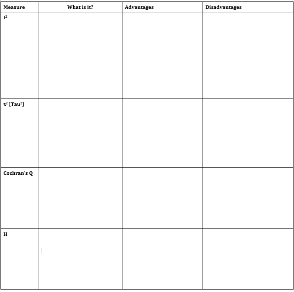
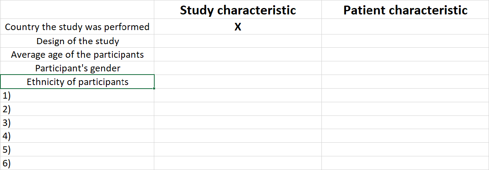

**Computer Assignment** 

**Estimated time: 3 hours**


```{r echo=F, warning=FALSE, message=FALSE}
library(knitr)
opts_chunk$set(fig.width=9, fig.height=6, fig.path='Figs/',
               warning=FALSE, message=FALSE, fig.pos = "H", comment = "")

```


# Objectives

Upon completion of this assignment the student will be able to:
- Perform subgroup analysis using
     - Review Manager  (from the Cochrane Collaboration),
     - the software package R
- Perform meta-regression using:
     - the software package R

*Instruction:* You can work alone or in couples.

*Product:* The output, data files and written answers to the questions.

*NOTE:* At the end of the computer assignment, mail the results to "Michail.Belias@radboudumc.nl" for an evaluation. 

We will discuss the outputassignment during the Working Group after this computer assignment.


##### \newpage

# Introduction

Bassler et.al [@Bassler_2004] conducted a Cochrane Review to evaluate the effects of Ketotifen alone or in combination with other co-interventions in children with asthma and/or wheezing. The primary outcome was the use of rescue bronchodilators.In the systematic review, a random effects model with the risk ratio as measure of treatment effect was used throughout. The meta-analysis of the clinical judgement data contains 10 studies. Let’s import the data to start our analysis. In order to do that we have to call the readxl package using the library("readxl") command.  If a package is not installed in your computer you can install it by using the *install.packages('name of the package')* command. Another option is to import the data with the ready-made R Studio option dialog in the *Eniviroment* tab on your top right. Import the data and have a look at them.

```{r}
library("readxl")
Ketotifen =  read_xlsx("Data/Ketotifen.xlsx")
```

We can see the first rows of our data with the *head()* command. 


```{r eval=FALSE}
View(Ketotifen)
```

**Shortly describe the variables in your data**

\newline <br>    

*Ee:*

\newline <br>    

*Ne:*

\newline <br> 

*Ec:*

\newline <br> 

*Nc:*

\newline <br> 

*blind:*

**Fill the following 2x2 tables for the Croce and Longo studies**

\newline <br> 

\newline <br> 

\newline <br> 

\newline <br> 




**Calculate the Risk Ratios and log Risk Ratios, Variance (or SE) and sample sizes.**

\newline <br> 

\newline <br> 

\newline <br> 

\newline <br> 

**What relationship between sample size and variance do you expect?**

\newline <br> 

\newline <br> 

\newline <br> 

\newline <br> 

**Is your expectation true?**

##### \newpage

# Perform a random-effects meta-analysis

We will perform a random-effects model because we want to generalise our conclusions to a broader population and because our assumption is that the treatment effects may come from a distribution rather than from a common (fixed) effect. We will use the *meta* package. The primary function for dichotomous outcomes is *metabin()*, for continous *metacont()* and for incidence rates *metainc()*.

```{r}
library("meta")
```


meta package offers also the opportunity to reporduce meta-analysis or plots suggested from other popular statistical packages, by using the *settings.meta* function.

```{r eval=FALSE}
- settings.meta("revman5")

- settings.meta("jama")

```

The first command can be used to reproduce meta-analyses from Cochrane reviews conducted with Review Manager 5.3 and specifies to use a RevMan 5.3 layout in forest plots. The second command can be used to generate forest plots following instructions for authors of the Journal of the American Medical Association.


Reminder: An easy way to check the help file of any package and/or function in R is to use a questionmark or a double question mark sign( *?* or *??*) and then the name of the function or package, for instance *?metabin*.

\newline <br>   

**meta** package has an excellent help file, take advantage of it. 

\newline <br>    


We want to perform a random-effects meta-analysis with risk ratio as an effect size measure, using the empirical Bayes (EB) as a $\tau^2$ estimator. We will also show the prediction interval *prediction = T*.

A prediction interval is an estimate of an interval in which a future study will fall with a certain probability, given the studies that have already been observed. A prediction interval is wider than a confidence interval, because it takes into account the full uncertainty over the summary estimate, describes the whole distribution of effect in a random-effects model, the degree of between-study heterogeneity and then gives a range for which we are 95% (this can change if wanted) sure that the treatment effect in a new study lies within. 

In your syntax, please fill the … , in the metabin command below with the appropriate variables from the data:

```{r  eval=FALSE}


res.RE = metabin(event.e = .. ,      ## Events of treated
                 n.e = .. ,          ## Total number of treated
                 event.c = .. ,      ## Events of control
                 n.c = ..,           ## Total number of treated
                 sm = ..,            ## Effect size
                 method = ..,        ## weight calculation method
                 data = ..,          ## the data-set
                 studlab = ..,       ## The study names
                 method.tau=..,      ## tau estimator method
                 comb.fixed =...,    ## A logical (TRUE/FALSE) indicating
                                     ## whether a fixed or random 
                 comb.random=...,    ## effect meta-analysis should 
                                     ## be conducted.
                 prediction = ...    ## logical if prediction interval
                                     ## should be printed
                 )

```

Print the output and make a forest plot of the results. Also show the p-value of the overall treatment effect in this forest plot (**Hint: use in the option test.overall.random = TRUE**)

```{r echo =TRUE}

res.RE = metabin(event.e = Ee ,      ## Events of treated
                 n.e = Ne ,          ## Total number of treated
                 event.c = Ec ,      ## Events of control
                 n.c = Nc,           ## Total number of treated
                 sm = "RR",          ## Effect size
                 method = "Inverse", ## weight calculation method
                 data = Ketotifen,   ## the data-set
                 studlab = study,    ## The study names
                 method.tau = "EB",  ## tau estimator method
                 comb.fixed = F,
                 prediction = T
                 )

```


```{r echo =TRUE, eval=FALSE}
res.RE
forest(res.RE,             ## 
       lab.e="Ketotifen",     ##
       lab.c="Placebo",      ##
       test.overall.random=TRUE)
```

\newline <br>    

\newline <br>    

\newline <br>    

\newline <br>    

\newline <br>    

\newline <br>

**What is the Inverse-Variance method? Are there any other choices? If yes which?**

\newline <br>    

\newline <br>    

\newline <br>    

\newline <br>    

\newline <br>    

\newline <br>


**Interpret the results**


\newline <br>    

\newline <br>    

\newline <br>    

\newline <br>    

\newline <br>    

\newline <br>    


**Does the Ketotifen help the patients?**
**How much is the increase/decrease of the use of rescue bronchodilators?**
\newline <br>    

\newline <br>    

\newline <br>    

\newline <br>    

\newline <br>    

\newline <br>    


**Describe what Q, $I^2$ and $\tau^2$ are and then report their estimated values (use the internet)**


  

**Report Q , $I^2$ and $\tau^2$ estimated values**

\newline <br>    

\newline <br>    

\newline <br>    

\newline <br>    

\newline <br>    

\newline <br>  


**Is the heterogeneity large?**

\newline <br>    

\newline <br>    

\newline <br>    

\newline <br>    

\newline <br>    

\newline <br>   


**Do our data agree with the random-effects model assumption we made?**

\newline <br>    

\newline <br>    

\newline <br>    

\newline <br>    

\newline <br>    

\newline <br>  

##### \newpage

## Subgroup analysis

Until now we 1) conducted a meta-analysis, in order to find out whether the use of Ketotifen is beneficial or not and 2) we pooled our treatment effects using a random-effects model, because we assumed that the treatment effects of the studies come from a distribution of effects.

This is one aim of meta-analysis. Another is to investigate our data in order to understand where do these between-study differences come from. We observed, that some studies had a common design. Particularly Chay et al., Rackham et al., and Van Asperen et al. used blinding. We wish to investigate if we can explain some heterogeneity by splitting the studies into two meta-analyses: one for the blinded and one for not-blinded studies.

Blinding is a study characteristic, not a patient characteristic, therefore we can perform subgroup analysis with it. Study characteristics can also be driven from characteristics of the participants. For instance, the mean age of the participants is a study characteristic, while the personal age of the participant is a patient characteristic.


**In an hypothetical study classify the following variables and give 2 examples of study characteristics, 2 of purely patient characteristics and 2 of study characteristic driven from patient characteristics.**



\newline <br>    

\newline <br> 


In order to perform a subgroup analysis we use again the function **metabin()**, but add also the option **byvar = "name of the subgrouping variable"**.


```{r eval=FALSE}

res.SA = metabin(event.e = .. ,      ## Events of treated
                 n.e = .. ,          ## Total number of treated
                 event.c = .. ,      ## Events of control
                 n.c = ..,           ## Total number of treated
                 sm = ..,            ## Effect size
                 method = ..,        ## weight calculation method
                 data = ..,          ## the data-set
                 studlab = ..,       ## The study names
                 method.tau=..,      ## tau estimator method
                 comb.fixed =...,    ## A logical (TRUE/FALSE) indicating
                                     ## whether a fixed or random 
                 comb.random=...,    ## effect meta-analysis should 
                                     ## be conducted.
                 byvar = ...,        ## The splitting variable 
                 prediction = ...    ## logical if prediction interval
                                     ## should be printed
                 )


```

Print the output and make a forest plot. Also show the p-value of the overall treatment effect (**Hint: test.overall.random = TRUE**)

```{r echo =TRUE}

res.SA = metabin(event.e = Ee ,      ## Events of treated
                 n.e = Ne ,          ## Total number of treated
                 event.c = Ec ,      ## Events of control
                 n.c = Nc,           ## Total number of treated
                 sm = "RR",          ## Effect size
                 method = "Inverse", ## weight calculation method
                 data = Ketotifen,   ## the data-set
                 studlab = study,    ## The study names
                 method.tau="EB",    ## tau estimator method
                 comb.fixed =F,      ## A logical (TRUE/FALSE) indicating
                                     ## whether a fixed or random 
                 comb.random=T,      ## effect meta-analysis should 
                                     ## be conducted.
                 
                 byvar = blind,      ## The splitting variable 
                 prediction = T      ## logical if prediction interval
                                     ## should be printed
                 )

# forest(res.SA)

```


**Note: for better looking forest-plots see the help file (?meta::forest )**

*Does the method of blinding explain adequately the statistical heterogeneity between studies? Why?*

\newline <br>    

\newline <br> 

\newline <br>    

\newline <br> 

**Report the results of the subgroups table (copy-paste)**

\newline <br>    

\newline <br> 

\newline <br> 


**What are the values of the per-subgroup $Q$, $I^2$ and $tau^2$ now? What do they represent?**

\newline <br>    

\newline <br>    

\newline <br>    

\newline <br>    

\newline <br>    


**Report the test for subgroup differences (copy-paste). How should you interpret it? Discuss Q, d.f. and p-value.**

\newline <br>    

\newline <br>    

\newline <br>    

\newline <br>    

\newline <br>    


##### \newpage


# Linear regression (a refresher)

Linear regression is a statistical approach where a continuous (dependent) variable is associated with one or more explanatory variables (or independent variables). The general formula for the linear regression is $Y_i =  \beta_0 + \beta_1 \times X_{i1} + \beta_2 \times X{i2} + ... + \beta_n \times X_{in} +  \epsilon_i$. The case of one independent $X_1$ variable is called simple linear regression, while for more than one independent variable, the process is called multiple linear regression. The $\epsilon_i$ is called the error term and is normally distributed with mean of zero and variance $\sigma^2$. 

In linear regression we can use as $Y_i$'s observations of participants, but we can also use observations of groups. When a linear regression is fitted in a data-set of studies then we call it meta-regression.

# Meta-regression with a binary covariate 

In the Ketotifen example above we splitted our meta-analysis into two subgroups and performed a separate meta-analysis for each. Therefore, we estimated 2 separate $\tau^2$'s for the subgroups. In some analyses, it is preferred to use a common $\tau^2$. If you perform a subgroup analysis with a common $\tau^2$ this is exactly equal to a meta-regression with the subgroup variable as an independent variable. 


** Why don you think this is happening?**

\newline <br>    

\newline <br>    

\newline <br>    

\newline <br>    

\newline <br>    


Perform a common $\tau^2$ subgroup analysis (*Hint: use the common.tau = TRUE option in your function*). 

\newline <br>   

*Perform a Subgroup analysis using a common $\tau^2$*


```{r echo =TRUE}

res.SA.2 = metabin(event.e = Ee ,      ## Events of treated
                 n.e = Ne ,          ## Total number of treated
                 event.c = Ec ,      ## Events of control
                 n.c = Nc,           ## Total number of treated
                 sm = "RR",          ## Effect size
                 method = "Inverse", ## weight calculation method
                 data = Ketotifen,   ## the data-set
                 studlab = study,    ## The study names
                 method.tau="EB",    ## tau estimator method
                 byvar =  blind,     ## The splitting variable  
                 comb.fixed =F  ,    ## A logical (TRUE/FALSE) indicating
                                     ## whether a fixed or random 
                 comb.random=T  ,    ## effect meta-analysis should 
                                     ## be conducted.
                 tau.common = T,     ## logical to set subgroup taus equal  
                 prediction = T      ## logical if prediction interval
                                     ## should be printed
                 )

# forest(res.SA.2)

```


**Report Q, $I^2$ and $\tau^2$ estimated values.**

\newline <br>    

\newline <br>    

\newline <br>    

\newline <br>    

\newline <br>    

**Which values have changed compared to the first subgroup analysis?**

\newline <br>    

\newline <br>    

\newline <br>    

\newline <br>    

\newline <br> 


Now let's use the *metareg()* function to fit a meta-regression, using the log risk ratios as a dependent variable and the blinding as an independent one. The options needed are a *meta* object (the random effects meta-analysis we did at the start is one) and the categorical variable we wish to use (in our case blinding).


**Fill the ....**
```{r eval=FALSE}
res.MR.SA =metareg(x = .... ,      ## an object of class meta
                  formula = blind, ## we can use more than one variables
                  ## then we use the formula
                  ## for instance X1 + X2
                  hakn = T         ##A logical indicating whether 
                  ##the method by Hartung and Knapp should be 
                  ##used to adjust test statistics and confidence intervals.
                  )
```

**Compare the subgroup analysis with common $\tau$s with the meta-regression output.**

\newline <br>    

\newline <br>    

\newline <br>    

\newline <br>    

\newline <br> 


**Which values are common?**

\newline <br>    

\newline <br>    

\newline <br>    

\newline <br>    

\newline <br> 


**Explain how the estimates and the CIs of the meta-regression can be transformed into the ones of the subgroup analysis.**

\newline <br>    

\newline <br>    

\newline <br>    

\newline <br>    

\newline <br> 

**Make inferences.**

\newline <br>    

\newline <br>    

\newline <br>    

\newline <br>    

\newline <br> 

##### \newpage


# Meta-regression with a continuous dependent variable

In this section we will try to explain again part of the heterogeneity, but instead of using a categorical variable we will use a continuous dependent variable. 

We will use the meta-analysis of Colditz et al. [@Colditz_1994], where he evaluated the overall effectiveness of the Bacillus Calmette-Guerin vaccine against tuberculosis. In addition, covariates that may potentially influence the effect of vaccination were examined. 

**Note: we are using AGAIN a variable that is a study characteristic, not a patient characteristic**

We can use the Colditz data straight from the metafor package without loading it, with "::".

```{r }

dat <- metafor::dat.colditz1994

```

We believe that part of the between-study heterogeneity can be due to the country’s place on the world map. That is a reasonable thing in epidemics, since the climate may affect the disease characteristics (prevalence, transmissibility, etc). Therefore, we will fit a meta-regression using the logRR as dependent variable and he absolute geographical latitude as an independent.

First, perform a random-effects meta-analysis, with Empirical Bayes(sometime called Paule-Mandel) $\tau^2$ estimate and then fit a meta-regression using the absolute geographical latitude ("ablat") as a independent variable. 

**Another commonly used $\tau^2$ estimator is DerSimonian-Laird. Fit the meta-regression with DL too**

```{r eval=FALSE}

res.RE =  metabin(event.e = ...,
                  n.e =  ... ,
                  event.c =  ...,
                  n.c =  ...,
                  data = ..., 
                  studlab = paste(author, year), 
                  sm = ..., 
                  method.tau =...  
                  )


res.RE.MR =metareg(x = res.RE , ## an object of class meta
                  formula = ....,
                  hakn = T)


```


```{r echo =TRUE}
res.RE =  metabin(event.e = tpos,
                  n.e =  tpos+tneg ,
                  event.c =  cpos,
                  n.c =  cpos+cneg,
                  data = dat, 
                  studlab = paste(author, year), 
                  sm = "RR")


res.RE.MR =metareg(x = res.RE , ## an object of class meta
                  formula = ablat,
                  hakn = T)

```

```{r echo =TRUE, eval=FALSE}

res.RE

```


**Report the Test for Residual Heterogeneity and the Test for Moderators**

\newline <br>    

\newline <br>    

\newline <br>    

\newline <br>    

\newline <br>    

**Interpret your results**

\newline <br>    

\newline <br>    

\newline <br>    

\newline <br>    

\newline <br>  

**What are your conclusions?**

\newline <br>    

\newline <br>    

\newline <br>    

\newline <br>    

\newline <br>    

Google the absolute geographical latitude of Nijmegen (or any other city you like).

**Based on our model calculate the predicted logRR and the corresponding 95% CI  for Nijmegen (or any other city you like). Transform the results into estimates for the RR.**

\newline <br>    

\newline <br>    

\newline <br>    

\newline <br>    

\newline <br>    

**What are the absolute geographical latitude ranges we can safely predict?** 

\newline <br>    

\newline <br>    

\newline <br>    

\newline <br>    

\newline <br>  


We can also plot the effect estimates over the range of the absolute geographical latitude, so that we have a visual representation, using the *bubble()* command. See the help file (*??bubble.metareg*).

```{r}
bubble(res.RE.MR)
```


**Which studies are influential?**

\newline <br>    

\newline <br>    

\newline <br>    

\newline <br>    

\newline <br> 

**What does the size of the bubbles represent?**

\newline <br>    

\newline <br>    

\newline <br>    

\newline <br>    

\newline <br> 


# Other options in meta package


R package meta (Schwarzer, 2007) 

1. Fixed effect and random effects model:

    - Meta-analysis of continuous outcome data (metacont)
    - Meta-analysis of binary outcome data (metabin)
    - Meta-analysis of incidence rates (metainc)
    - Generic inverse variance meta-analysis (metagen)
        - when you have already calculated the logOutcomes and variances yourself
    - Meta-analysis of single correlations (metacor)
    - Meta-analysis of single means (metamean)
    - Meta-analysis of single proportions (metaprop)
    - Meta-analysis of single incidence rates (metarate)
    
2. Several plots for meta-analysis:

    - Forest plot (forest)

    - Funnel plot (funnel)

    - Galbraith plot / radial plot (radial)

    - L'Abbe plot for meta-analysis with binary outcome data (labbe)

    - Baujat plot to explore heterogeneity in meta-analysis (baujat)

    - Bubble plot to display the result of a meta-regression (bubble)

3. Statistical tests for

  - funnel plot asymmetry (metabias) and 
  - trim-and-fill method (trimfill) to evaluate bias in meta-analysis

4. Prediction interval, Hartung-Knapp and Paule-Mandel method for random effects model (see arguments prediction, hakn, and method.tau, respectively, in meta-analysis functions listed under 1. Fixed effect and random effects model)

5. Cumulative meta-analysis (metacum) and leave-one-out meta-analysis (metainf)


##### \newpage

# References

